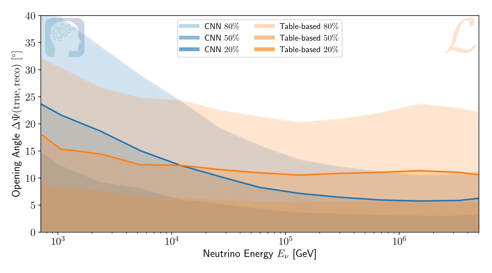

.. IceCube DNN reconstruction

About the Project
*****************

The |dnn_reco| project is a general software framework which intends to
facilitate the usage of Deep Neural Networks within IceCube.
This covers a wide range of supervised learning applications such as regression (direction, energy, vertex, ...) and classification tasks.
The software framework not only covers the development and training of neural
network models, but also enables their application and distribution.

A major concern in the context of machine learning is reproducibility.
Trained models are very powerful, but can be susceptible to incorrect usage
and mis-configured settings.
Especially when working in a collaborative effort where such models are
shared between users, there have to be mechanisms in place to ensure
their correct usage.
The |dnn_reco| project aims to simplify and secure the process of model
creation and distribution between users.

One of the guiding design concepts of the |dnn_reco| project is
reproducibility.
The software framework covers the complete production line from creating
training data, over training neural networks and applying the trained models
to new data.
Throughout this process, used settings in the intermediate steps and especially
in the training procedure are automatically saved.
Once a neural network model is trained, it can easily be ``exported``.
The exported models contain all necessary configs, log files, and software
versions needed to reproduce the training procedure.
In addition, all required settings are exported such that other users may
apply these models with the provided I3Module.
The |dnn_reco| framework ensures that an exported model is used with the
correct settings and input parameters.

    An example application of the |dnn_reco| project:
    cascade angular reconstruction.
    A comparison to the standard reconstruction method (Monopod)
    in IceCube is shown.
    The convolutional neural newtork (CNN) trained within the |dnn_reco|
    framework can outperform the standard reconstruction method at higher
    energies, while reducing the runtime by two to three orders of magnitude.

.. fad
    .. figure:: figures/runtime-1.png
        :width: 70 %
