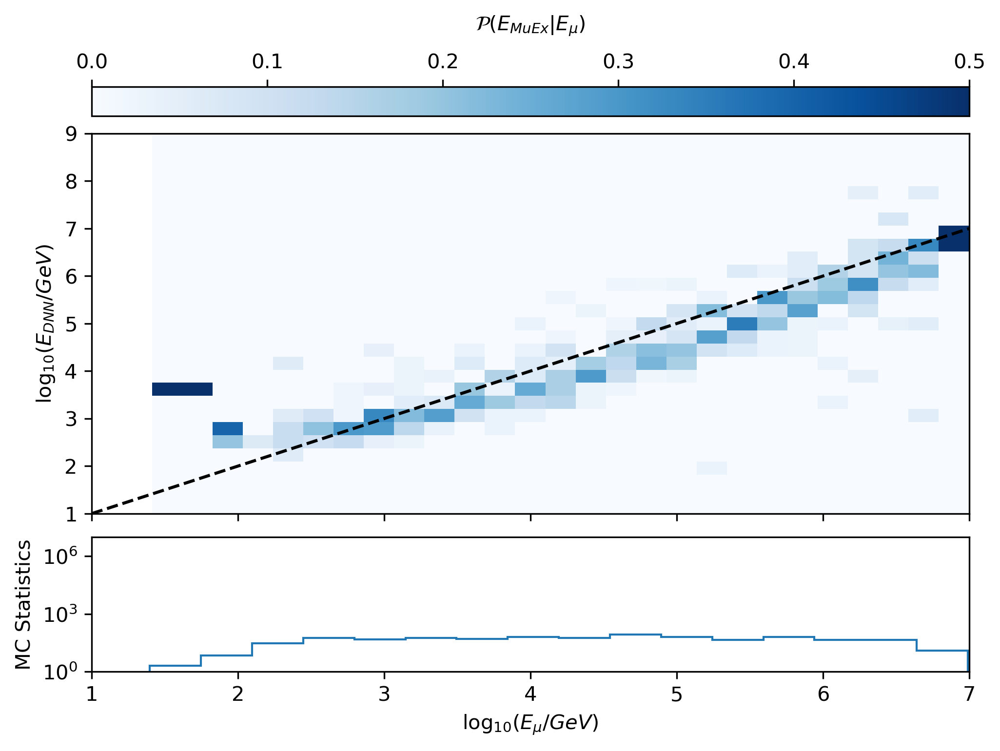
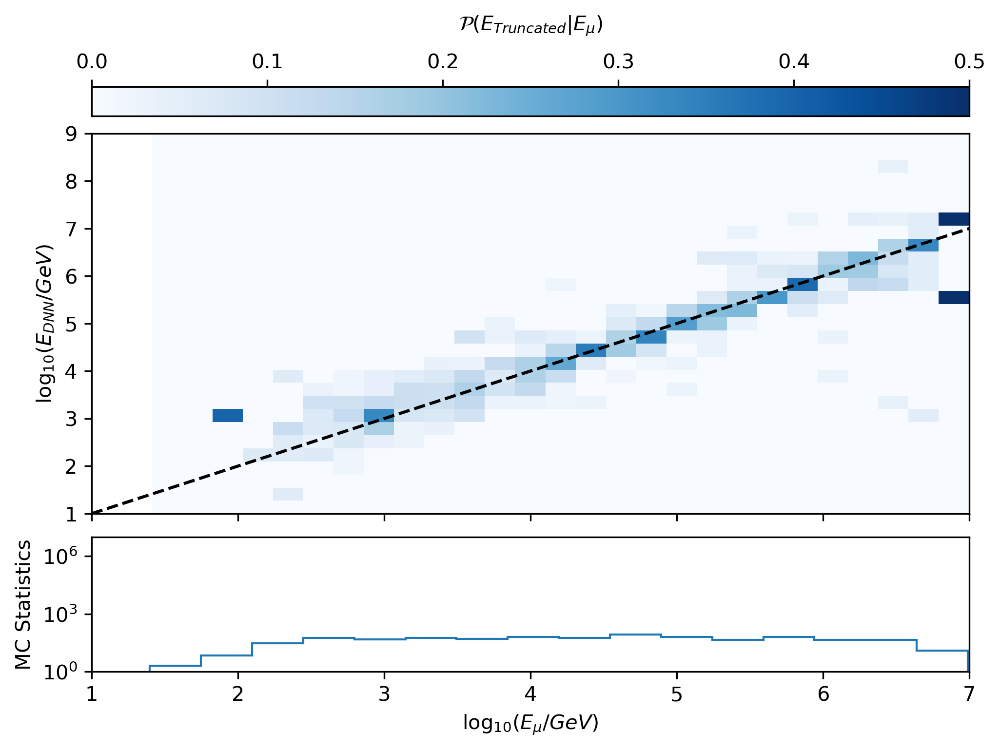
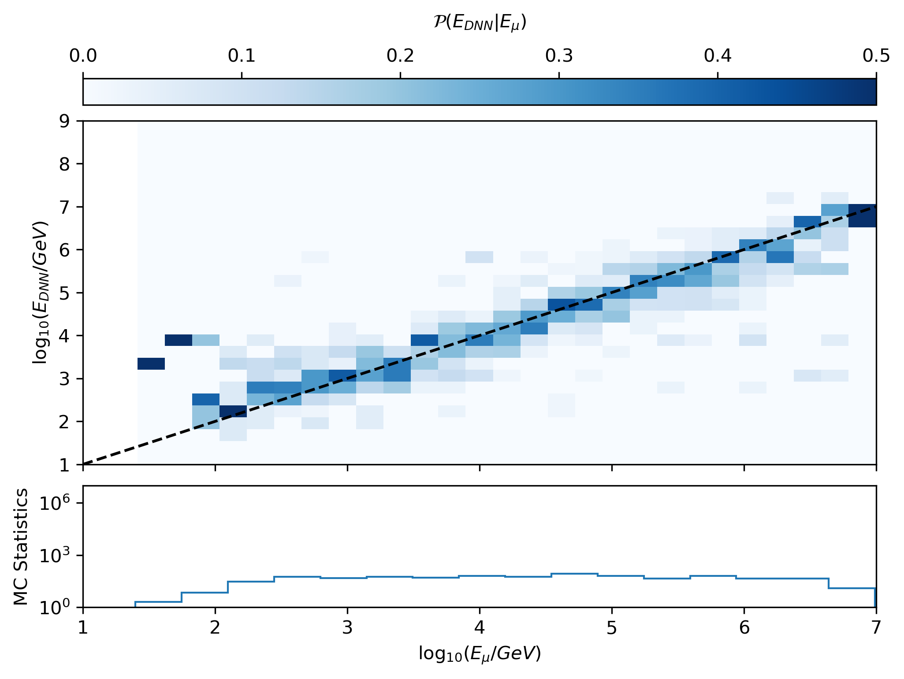

.. IceCube DNN reconstruction

.. _bootcamp_visualize:

Visualize Results
*****************

We will visualize the results of our trained model here.
There is an ipython notebook provided at
``/shared/dnn_reco_tutorial/visualize_results.ipynb``
that loads in the processed hdf5 file from the previous page and displays
the energy reconstruction performance of the trained model in comparison to
MuEx and Truncated Energy.

Copy the notebook into your directory

.. code-block:: bash

    cp /shared/dnn_reco_tutorial/visualize_results.ipynb $DNN_HOME/

and run the ipython notebook.

Here are the result plots of a model that was run for 44500 iterations:

    This is the correlation plot for MuEX.

    This is the correlation plot for Truncated Energy.

    This is the correlation plot for DNN reco.