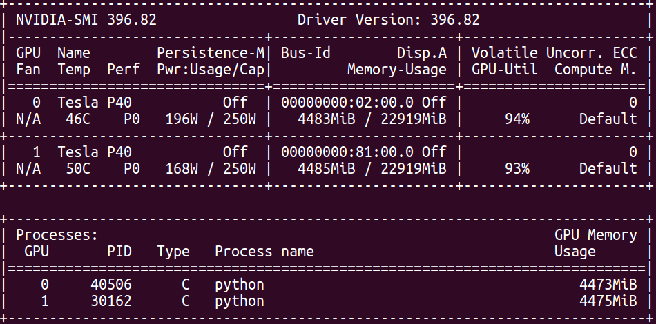
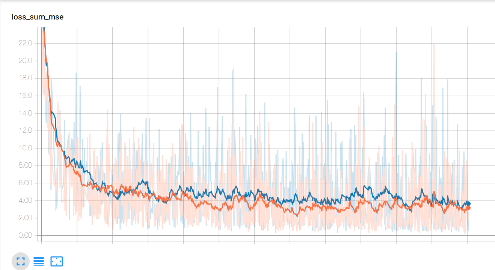

.. IceCube DNN reconstruction

.. _monitor_progress:

Monitor Progress
****************

In this section we will cover how you can monitor the training process.
It is often crucial to keep an eye on the GPU utilization and the training
curves as these can hint at possible culprits.
We can check the GPU utilization of the training procedure by opening a
second terminal and executing:

.. code-block:: bash

    nvidia-smi

    # to update every 3 seconds we can do
    watch -n 3 nvidia-smi

If the GPU utilization is too low, this often means, that the neural network
is not being fed data fast enough.
The data loading and feeding is handled by the ``DataHandler`` class which
provides a generator that utilizes multiprocessing.
The input pipeline consists of three steps:

    1. A number of ``num_jobs`` workers load files from the file list
       into memory and extract the DOM input data, labels, and misc
       data if defined.
       The events (input data, labels, misc data) of the loaded
       file is then queued onto a multiprocessing queue named
       'data_batch_queue'.

    2. Another worker aggregates the events of several files
       (number of files defined by ``num_add_files``) together
       by dequeuing elements from the 'data_batch_queue'.
       It then creates batches from these events
       (randomly if 'sample_randomly' == True ).
       These batches are then put onto the 'final_batch_queue'.
       Elements in the 'final_batch_queue' now include ``batch_size``
       many events ( tuples of dom_responses, cascade_parameters).

    3. The third level consists of the actual generator object.
       It pops elements off of the 'final_batch_queue' and yields
       these as the desired batches of
       (input data, labels, misc data).

The main keys controlling the input pipeline are:

``num_jobs``:
    Number of workers that are used in parallel to load files and populate the
    'data_batch_queue'.

``file_capacity``:
    The capacity of the 'data_batch_queue'. The workers can only enqueue
    data to the 'data_batch_queue' if the capacity has not been reached.
    If the 'data_batch_queue' has reached its capacity, the workers will halt
    until elements get dequeued.

``batch_capacity``:
    The capacity of the 'final_batch_queue' which holds the batches of size
    ``batch_size``. The batches dequeued from this queue are fed directly
    into the neural netwok input tensors.

``num_add_files``:
    This defines how many files should be aggregated before randomly sampling
    batches from the loaded events.
    Ideally, one would want to load as many files as possible to make sure that
    the batches get mixed together well with events from different training
    files. However, the training datasets are typically so large, that we
    are only able to load a small subset of events at a time.

``num_repetitions``:
    If ``num_add_files`` is high enough, e.g. if we load enough events to
    sample from, we can reuse these events before loading the next files.
    This is much more efficient that only using the loaded events once.
    However, care must be taken since a too high number of repetitions in
    connection with a small number of loaded events can result in overfitting
    to those events.

The loss curves for the training and validation data provide us insights on
the training process.
We can identify overfitting and converging issues as well as monitor the
general progress.
All labels as well as the losses are automatically logged with tensorboard.
If you would like to add more variables to log,
just add these with the standard functions from the ``tf.summary`` module
in your custom modules.
Variables that need to be logged can be assigned to either of the FileWriter
objects of the base model class: ``self._train_writer`` or ``self._val_writer``.

We can then use tensorboard to render these logs.

.. code-block:: bash

    # If we run tensorboard remotely we must provide a port and make sure
    # to forward this port in the ssh connection
    tensorboard --logdir=PATH/TO/MY/LOGS --port 7475

If the port forwarding is correctly set up, you can then point your browser to
to the appropriate address.
More info on tensorboard is provided here:
https://www.tensorflow.org/guide/summaries_and_tensorboard.
