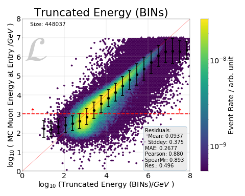
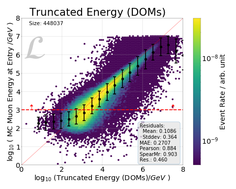
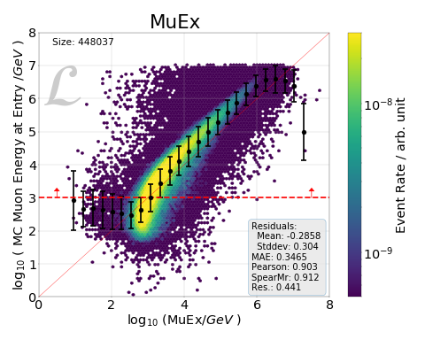
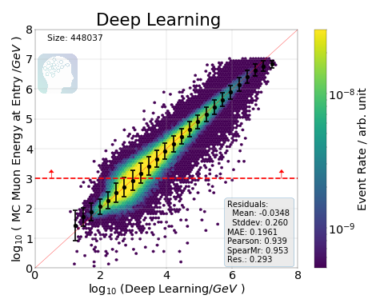

.. IceCube DNN reconstruction

.. _getting_started:

Getting Started
***************

In this tutorial we will learn how to:

* :ref:`Create training data from IceCube i3 files<create_training_data>`
* :ref:`Train our neural network model<train_model>`
* :ref:`Monitor the training progress<monitor_progress>`
* :ref:`Export and apply our trained model to IceCube i3 files<apply_model>`

We will use NuMu NuGen files (first 1010 files of dataset 11883) to train a
deep convolutional neural network that will predict the energy of the muon as
it enters the convex hull around the IceCube detector.

:ref:`Let's get started!<general_remarks>`

.. toctree::
   :maxdepth: 2
   :hidden:

   getting_started/00_general_remarks
   getting_started/01_create_training_data
   getting_started/02_train_model
   getting_started/03_monitor_progress
   getting_started/04_apply_model
